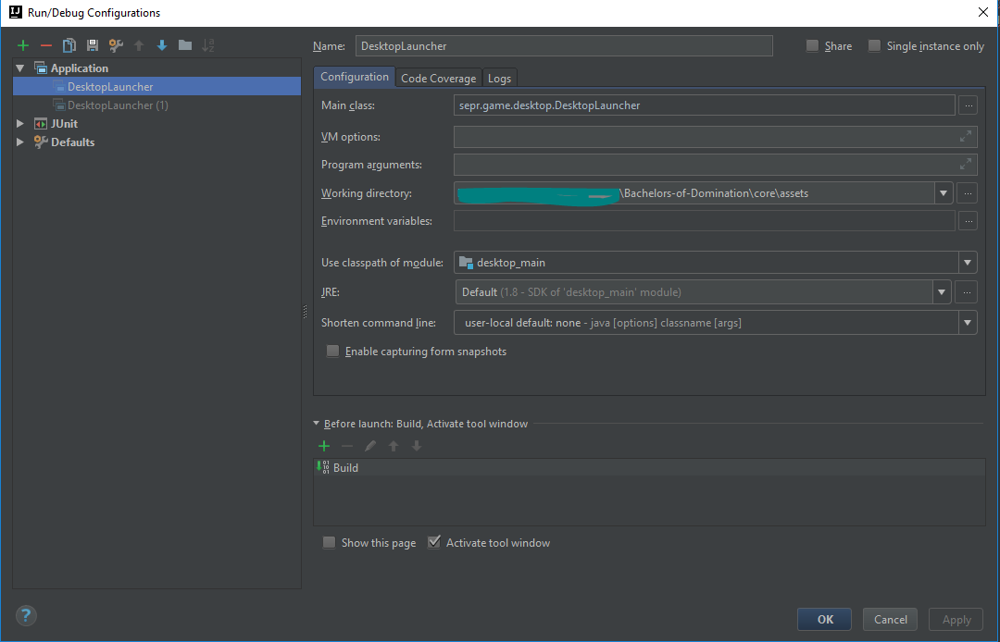

# Bachelors of Domination
## A strategy game by Risky Developments

[Risky Developments Website link](http://www.riskydevelpments.co.uk)  
[Jira link](http://www.riskydevelpments.co.uk/jira)

### Git Setup
To initialise the git repo `git init`, and to clone
`git clone https://github.com/RiskyDevelopments/Bachelors-of-Domination.git`

### IDE Setup
We recommend using JetBrain's IntelliJ IDEA [www.jetbrains.com/idea/download/](https://www.jetbrains.com/idea/download/)
 To setup the project gradle must be refreshed to build all the libraries. To do this inside IntelliJ go to 
`View -> Tool Windows -> Gradle` then in the Gradle projects window hit the refresh symbol.
You are then ready to run the game.

### Run game
In the top right of IntelliJ under `Select Run/Debug Configurations` select `Edit Configurations`. 
Then inside Application create a new configuration as so:  
 
Then you should be able to run the game from the run arrow every time.